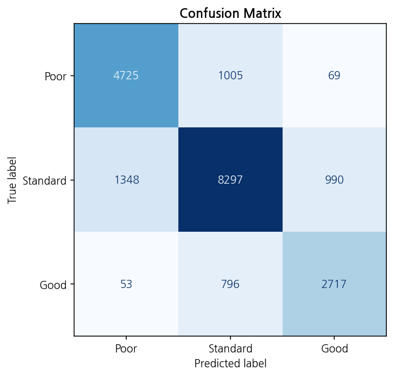
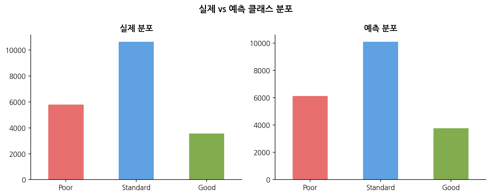

# Credit Score Classification

## 프로젝트 개요
신용카드 사용자의 월별 금융 데이터를 기반으로 신용등급(Poor / Standard / Good)을 분류하는 딥러닝 모델 성능향상

```python
# 기존 MLP 분류 모델 코드
import torch
import torch.nn as nn
import torch.optim as optim
from torch.utils.data import Dataset, DataLoader
import pandas as pd
from sklearn.model_selection import train_test_split
from sklearn.preprocessing import StandardScaler, LabelEncoder

file_path = 'train2.csv'
data = pd.read_csv(file_path)

data = data.drop(columns=['ID', 'Customer_ID', 'Name', 'SSN'])

categorical_columns = ['Occupation', 'Type_of_Loan', 'Credit_Mix', 'Payment_of_Min_Amount', 'Payment_Behaviour']

for col in categorical_columns:
    le = LabelEncoder()
    data[col] = le.fit_transform(data[col])

target_encoder = LabelEncoder()
data['Credit_Score'] = target_encoder.fit_transform(data['Credit_Score'])

X = data.drop('Credit_Score', axis=1).values
y = data['Credit_Score'].values

scaler = StandardScaler()
X = scaler.fit_transform(X)


X_train, X_test, y_train, y_test = train_test_split(X, y, test_size=0.2, random_state=42)

class CreditScoreDataset(Dataset):
    def __init__(self, X, y):
        self.X = torch.tensor(X, dtype=torch.float32)
        self.y = torch.tensor(y, dtype=torch.long)

    def __len__(self):
        return len(self.y)

    def __getitem__(self, idx):
        return self.X[idx], self.y[idx]


train_dataset = CreditScoreDataset(X_train, y_train)
test_dataset = CreditScoreDataset(X_test, y_test)

train_loader = DataLoader(train_dataset, batch_size=32, shuffle=True)
test_loader = DataLoader(test_dataset, batch_size=32, shuffle=False)

class MLP(nn.Module):
    def __init__(self, input_size):
        super(MLP, self).__init__()
        self.layer1 = nn.Linear(input_size, 64)
        self.layer2 = nn.Linear(64, 32)
        self.layer3 = nn.Linear(32, 3)
        self.relu = nn.ReLU()

    def forward(self, x):
        x = self.relu(self.layer1(x))
        x = self.relu(self.layer2(x))
        x = self.layer3(x)
        return x

device = torch.device("cuda" if torch.cuda.is_available() else "cpu")


input_size = X_train.shape[1]
model = MLP(input_size).to(device)

criterion = nn.CrossEntropyLoss()
optimizer = optim.Adam(model.parameters(), lr=0.001)

epochs = 20

for epoch in range(epochs):
    model.train()
    running_loss = 0.0
    correct_train = 0
    total_train = 0

    for inputs, targets in train_loader:
        inputs, targets = inputs.to(device), targets.to(device)
        optimizer.zero_grad()
        outputs = model(inputs)
        loss = criterion(outputs, targets)
        loss.backward()
        optimizer.step()
        running_loss += loss.item()

        _, predicted = torch.max(outputs, 1)
        total_train += targets.size(0)
        correct_train += (predicted == targets).sum().item()

    model.eval()
    correct_val = 0
    total_val = 0
    with torch.no_grad():
        for inputs, targets in test_loader:
            inputs, targets = inputs.to(device), targets.to(device)
            outputs = model(inputs)
            _, predicted = torch.max(outputs, 1)
            total_val += targets.size(0)
            correct_val += (predicted == targets).sum().item()

    train_accuracy = 100 * correct_train / total_train
    val_accuracy = 100 * correct_val / total_val
    print(f'Epoch [{epoch+1}/{epochs}], Loss: {running_loss/len(train_loader):.4f}, '
          f'학습 정확도: {train_accuracy:.2f}%, 평가 정확도: {val_accuracy:.2f}%')
```

## 베이스라인 모델 (MLP)

> [!NOTE]
> **모델 구조**
> - 3층 MLP (64 → 32 → 3)
> - 활성화 함수: ReLU
> - 옵티마이저: Adam (lr=0.001)
> - 전처리: StandardScaler 전체 적용, Type_of_Loan 단순 Label Encoding
> - 에폭: 20, 배치: 32

> [!WARNING]
> **한계점**
> - Type_of_Loan이 멀티레이블임에도 단순 Label Encoding 적용
> - 범주형/수치형 구분 없이 전체 스케일링
> - 클래스 불균형 미처리
> - 단순 구조로 피처 간 복잡한 관계 학습 어려움

## 데이터
- 출처: [Kaggle Credit Score Classification](https://www.kaggle.com/datasets/parisrohan/credit-score-classification)
- 구조: 12,500명 × 8개월 = 100,000행, 28개 피처
- 타겟: Credit_Score (Poor / Standard / Good)

## 전처리
- 식별자 컬럼 제거 (ID, Name, SSN, Customer_ID)
- Type_of_Loan 멀티레이블 → 더미변수 8개로 분해
- Payment_Behaviour → spent_level, payment_size 2개 컬럼으로 분리
- Credit_Mix, Payment_of_Min_Amount Ordinal 인코딩
- Occupation Label 인코딩

## EDA
- 수치형: 박스플롯, 히스토그램, 클래스별 분포 비교
- 범주형: 교차분석, 직업별 신용점수 히트맵, 대출종류별 분포
- Credit_Mix, Interest_Rate, Credit_History_Age가 핵심 예측 변수로 확인


## Feature Selection
- 타겟 상관 거의 없는 Total_EMI_per_month, Credit_Utilization_Ratio 제거
- 파생변수 5개 생성
  - debt_to_income: 부채/소득 비율
  - delay_severity: 연체 횟수 × 연체 기간
  - inquiry_per_card: 카드 수 대비 신용 조회수
  - balance_to_salary: 월수입 대비 잔액
  - loan_burden: 대출 수 × 이자율

## 모델
- **TabTransformer**
  - dim=32, depth=3, heads=4
  - MLP: GeLU 활성화, 항아리 형태 (dim×4 → dim×2 → 3)
  - Dropout: 0.1
- 옵티마이저: NAdam (lr=1e-3, weight_decay=1e-5)
- 스케줄러: StepLR (step_size=5, gamma=0.5)
- 분리: stratify 기반 8:2 무작위 분할

## 결과
| Metric | Score |
|--------|-------|
| Validation Accuracy | 0.XXXX |



