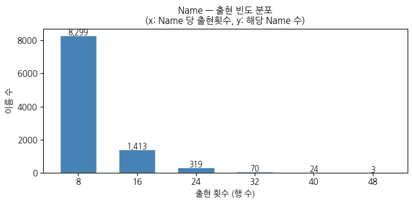
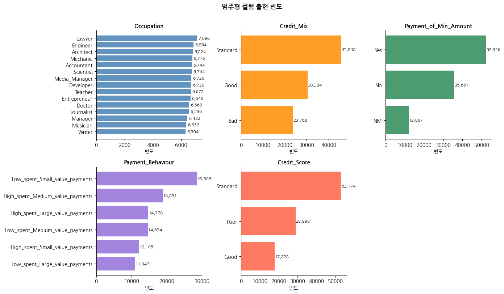
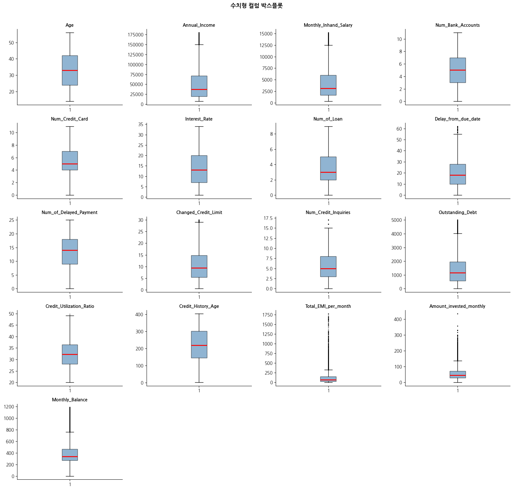
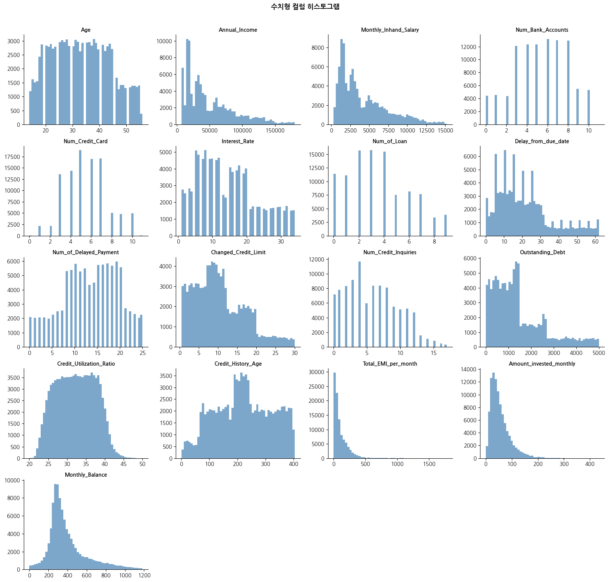

# 01. 데이터 탐색 및 전처리

## 데이터 개요

| 항목 | 내용 |
|------|------|
| 출처 | [Kaggle Credit Score Classification](https://www.kaggle.com/datasets/parisrohan/credit-score-classification) |
| 구조 | 100,000행 × 28컬럼 |
| 고객 수 | 12,500명 (Customer_ID 기준) |
| 월 범위 | 특정 연도 1~8월 |
| 타겟 | Credit_Score (Poor / Standard / Good) |

## 패널 구조 확인

모든 고객이 1~8월에 빠짐없이 존재하는지 확인하였다.

```python
customer_months = df.groupby('Customer_ID')['Month'].apply(set)
expected = set(range(1, 9))
incomplete = customer_months[customer_months != expected]
print(f"누락된 월이 있는 고객: {len(incomplete):,}")
# → 0명: 모든 고객이 1~8월 데이터를 보유
```

> [!NOTE]
> 고객당 8개월치 데이터가 균일하게 존재하므로, 패널 데이터 구조임을 확인.
> 단, 한 고객당 시점이 8개로 적어 시계열 모델 사용은 보류하고 횡단면 분류 문제로 접근하였다.

---

## object 컬럼 탐색 결과

| 컬럼 | 유니크값 수 | 특징 | 처리 방법 |
|------|------------|------|-----------|
| Name | 10,128 | 동명이인 존재, 식별자 | **제거** |
| Occupation | 15 | 순서 없는 명목형 | Label Encoding |
| Type_of_Loan | 수천 개 조합 | 쉼표 구분 멀티레이블 | **더미변수 분해** |
| Credit_Mix | 3 | Bad / Standard / Good 순서 있음 | Ordinal Encoding |
| Payment_of_Min_Amount | 3 | Yes / No / NM(미기재) | Ordinal Encoding |
| Payment_Behaviour | 6 | 지출규모 × 결제규모 복합 | **2개 컬럼으로 분리** |
| Credit_Score | 3 | 타겟 변수 | Ordinal Encoding |

### Name 출현 빈도 분포


### 범주형 컬럼 출현 빈도


---

## 수치형 컬럼 탐색

### 박스플롯


### 히스토그램


---

## 전처리 상세

### 1. 식별자 컬럼 제거
```python
df.drop(columns=['ID', 'Name', 'SSN', 'Customer_ID'], inplace=True)
# Month는 모델링 단계에서 제거
```

### 2. Type_of_Loan — 멀티레이블 더미변수 분해
단순 Label Encoding 시 조합이 수천 개로 폭발적으로 증가하므로,
실제 단일 대출 종류 8개를 더미변수로 분해하였다.

```python
LOAN_TYPES = [
    'auto loan', 'credit-builder loan', 'debt consolidation loan',
    'home equity loan', 'mortgage loan', 'payday loan',
    'personal loan', 'student loan'
]

def parse_loan(text):
    skip = {'no data', 'not specified'}
    if pd.isna(text):
        return []
    return [t.strip().lower() for t in text.split(',')
            if t.strip().lower() not in skip]

for loan in LOAN_TYPES:
    col_name = 'loan_' + loan.replace(' ', '_').replace('-', '_')
    df[col_name] = df['Type_of_Loan'].apply(lambda x: 1 if loan in parse_loan(x) else 0)

df.drop(columns=['Type_of_Loan'], inplace=True)
```

### 3. Payment_Behaviour — 복합 문자열 분리
`"High_spent_Large_value_payments"` 형태를 두 개의 수치형 컬럼으로 분리하였다.

```python
spent_map = {'Low': 0, 'High': 1}
size_map  = {'Small': 0, 'Medium': 1, 'Large': 2}

def parse_behaviour(text):
    try:
        parts = text.split('_spent_')
        return spent_map.get(parts[0], np.nan), size_map.get(parts[1].replace('_value_payments', ''), np.nan)
    except:
        return np.nan, np.nan

df[['spent_level', 'payment_size']] = df['Payment_Behaviour'].apply(
    lambda x: pd.Series(parse_behaviour(x))
)
```

### 4. 범주형 인코딩 요약

```python
# Credit_Mix: 순서 있는 범주형
df['Credit_Mix'] = df['Credit_Mix'].map({'Bad': 0, 'Standard': 1, 'Good': 2})

# Payment_of_Min_Amount: NM(미기재) 별도 카테고리 유지
df['Payment_of_Min_Amount'] = df['Payment_of_Min_Amount'].map({'No': 0, 'Yes': 1, 'NM': 2})

# Occupation: 순서 없는 명목형 → Label Encoding
le = LabelEncoder()
df['Occupation'] = le.fit_transform(df['Occupation'])

# Credit_Score (타겟)
df['Credit_Score'] = df['Credit_Score'].map({'Poor': 0, 'Standard': 1, 'Good': 2})
```

---

## 전처리 전후 비교

| 항목 | 전처리 전 | 전처리 후 |
|------|-----------|-----------|
| 컬럼 수 | 28 | 32 |
| object 컬럼 | 7 | 0 |
| 결측치 | 0 | 0 |
