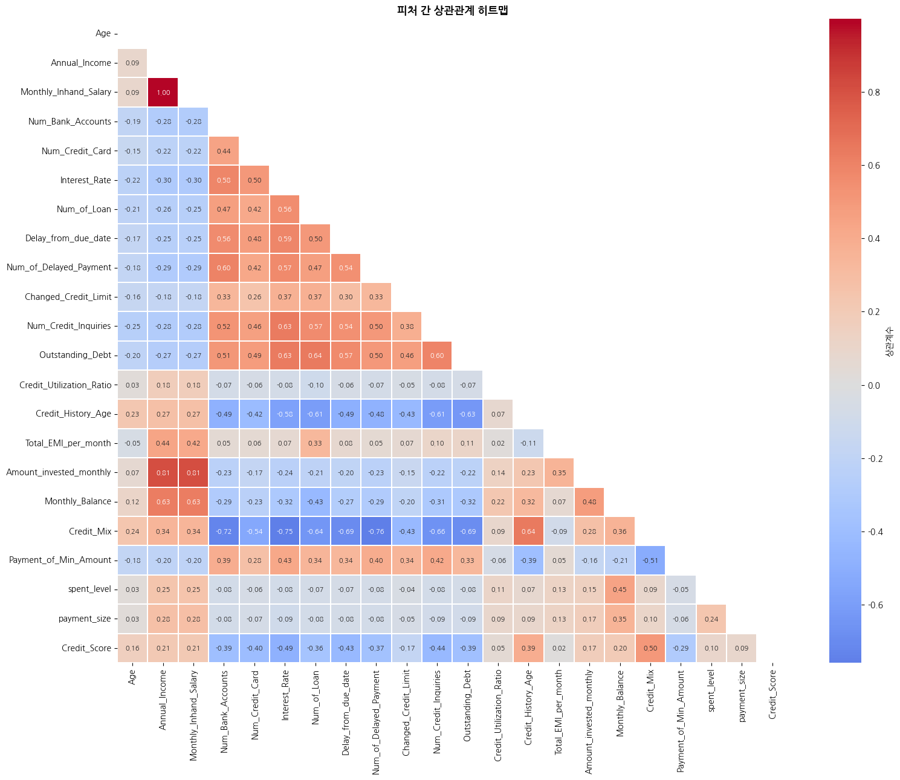
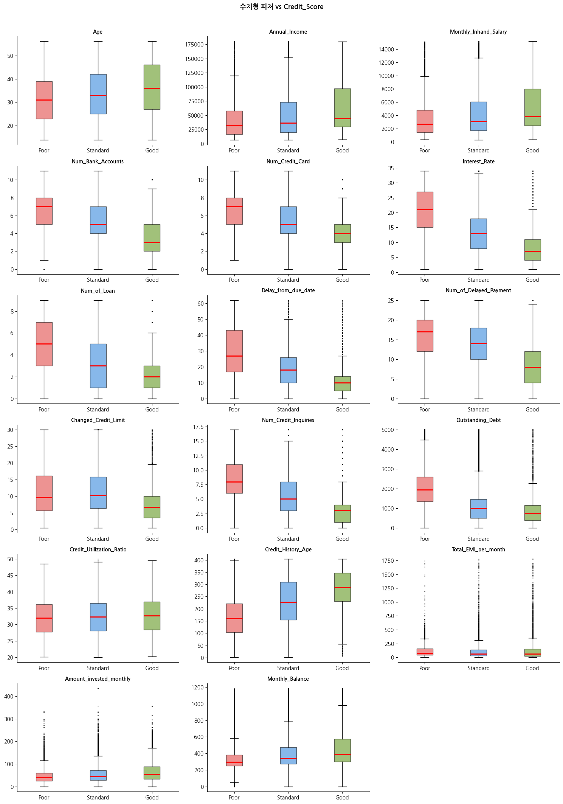
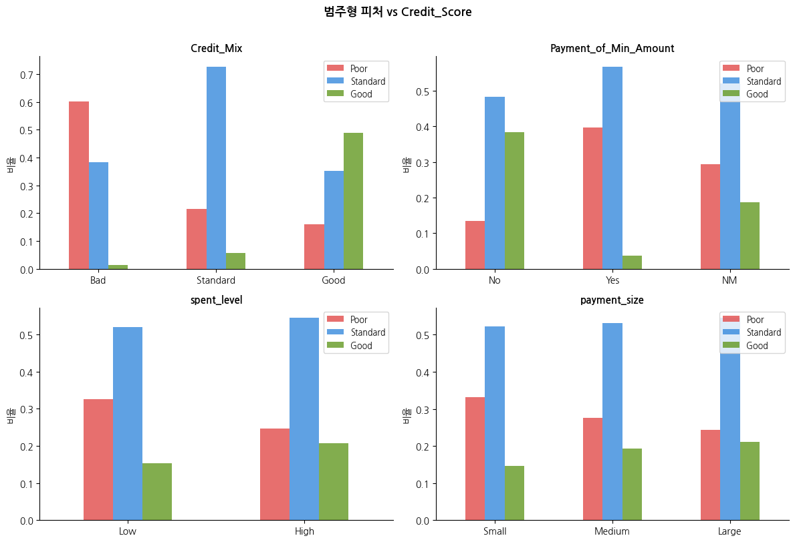
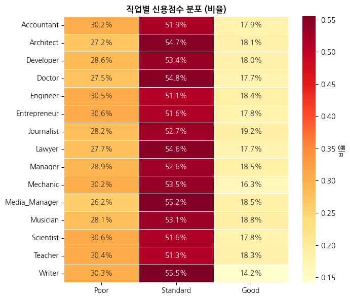
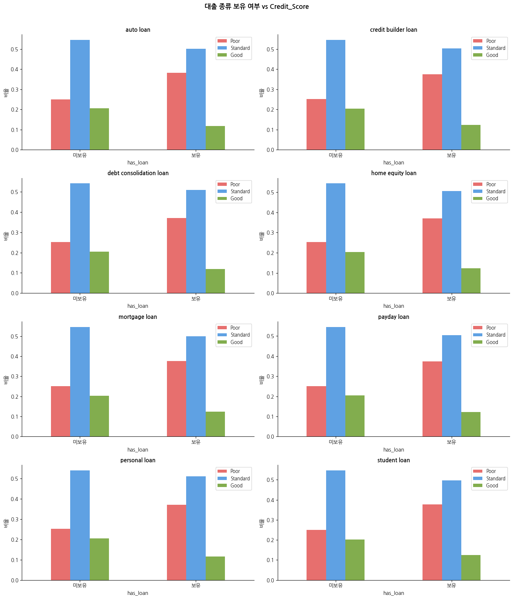

# 02. EDA (탐색적 데이터 분석)

## 분석 방법

| 데이터 유형 | 시각화 방법 |
|------------|------------|
| 수치형 | 박스플롯, 히스토그램, 클래스별 분포 비교 |
| 범주형 | 출현 빈도 막대그래프, 교차분석 |
| 관계 분석 | 상관관계 히트맵, 직업별/대출종류별 신용점수 분포 |

---

## 수치형 피처 vs 타겟 상관관계

### 피처 간 상관관계 히트맵

### 수치형 피처 vs Credit_Score 클래스별 분포

### 음의 상관 (높을수록 Poor 가능성 ↑)

| 피처 | 상관계수 | 해석 |
|------|---------|------|
| Interest_Rate | -0.49 | 높은 이자율 = 신용 위험 |
| Num_Credit_Inquiries | -0.44 | 잦은 신용 조회 = 과다 대출 시도 |
| Delay_from_due_date | -0.43 | 연체 기간 길수록 신용 악화 |
| Num_Bank_Accounts | -0.39 | 과다 계좌 보유 = 신용 분산 |
| Outstanding_Debt | -0.39 | 미상환 잔액 증가 = 신용 위험 |

### 양의 상관 (높을수록 Good 가능성 ↑)

| 피처 | 상관계수 | 해석 |
|------|---------|------|
| Credit_History_Age | +0.39 | 오랜 신용 이력 = 신용 안정 |
| Annual_Income | +0.21 | 소득 높을수록 상환 능력 ↑ |
| Monthly_Balance | +0.20 | 잔액 여유 = 재정 안정 |

### 사실상 무관한 피처

| 피처 | 상관계수 |
|------|---------|
| Total_EMI_per_month | 0.02 |
| Credit_Utilization_Ratio | 0.05 |

> [!WARNING]
> Total_EMI_per_month, Credit_Utilization_Ratio는 타겟과의 상관이 거의 없어
> Feature Selection 단계에서 제거 대상으로 판단하였다.

---

## 범주형 피처 vs 타겟 교차분석

### 범주형 컬럼 출현 빈도

### Credit_Mix — 가장 강력한 예측 변수

| Credit_Mix | Poor | Standard | Good |
|-----------|------|----------|------|
| Bad | **60%** | 38% | 1.5% |
| Standard | 28% | 55% | 17% |
| Good | 16% | 35% | **49%** |

> [!NOTE]
> Credit_Mix 단일 변수만으로도 클래스를 강하게 구분할 수 있음.

### Payment_of_Min_Amount

| 납부 방식 | Poor | Standard | Good |
|----------|------|----------|------|
| Yes (최소금액만) | **40%** | 56% | 3.7% |
| No (전액 납부) | 22% | 40% | **38%** |
| NM (미기재) | 중간 수준 | - | - |

### Payment_Behaviour (spent_level / payment_size)
- High spent / Large payment일수록 Good 비율이 약간 높음 (15% → 21%)
- 단독 변별력은 강하지 않음

---

## 직업별 신용점수 분포

- 직업 간 Good 비율 차이: **14~19% 수준으로 매우 작음**
- Journalist(19.2%) > Writer(14.2%) 순이나 차이가 미미함
- **직업은 신용점수에 유의미한 영향을 주지 않는 변수**로 판단

---

## 대출 종류별 신용점수 분포

- 대출 종류별 신용점수 분포 차이가 크지 않음
- 특정 대출 보유 여부보다 **대출 수, 이자율 등 부담 지표**가 더 중요
